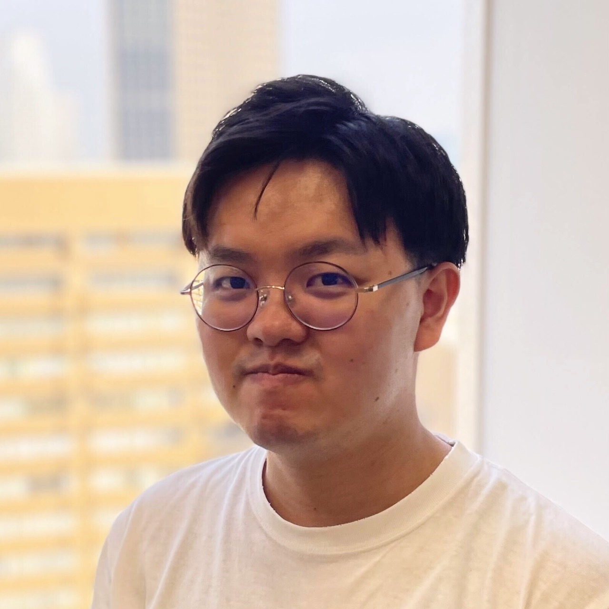

    
    
    

## Experience & Education

- **株式会社アラヤ**
  - シニアエンジニア・リサーチャー（現在）
  - 2025年現在，交通安全に関連する2つのプロジェクトで主要開発者として従事．
    1. 自由エネルギー原理と世界モデルの技術を応用し，運転者の視線・運転行動をモデリングする．実装にはPyTorchを使用．
    1. 拡張現実（AR）とエッジAIを用い，周囲の情報を検知して交通参加者に有用な情報を提供するシステム．開発にはC# (Unity)とJava (Android)を使用．
  - 過去には，自己教師あり学習による大規模脳波モデルや，Unreal Engineを用いた運転シミュレータなど様々な開発に従事．

- **東京大学 理学系研究科**
  - 修士（神経生物学，2021年）
  - マウスにおける光遺伝学とAI自動化した行動解析を用い，記憶固定に関する研究を実施．

- **京都大学**
  - 学士（生物物理学，2019年）

## Languages

- **Proficient**: Python, C#, 日本語
- **Conversant**: Java, Blueprint, 英語（TOEIC 900点）
- **Familiar**: C++, MATLAB, Bash, HTML/CSS, JavaScript

## Areas of Expertise & Interest

- **機械学習**：能動的推論，モデルベース強化学習，エネルギーベースモデル，予測符号化，対照学習，スコアベース生成モデル，大規模言語モデル
- **神経科学**：非侵襲脳コンピュータインタフェース，EEG/MEG，光遺伝学，スパイキングニューラルネットワーク
- **ゲーム・アプリ開発**：Unreal Engine, Unity, Android, AR

## Publications

1. Nobe, Sensho, and Shuntaro Sasai. 2025. "Direct Generation of Images from EEG Signals via Schrödinger Bridge." TBU.

1. Fujisawa, Ippei, Sensho Nobe, Hiroki Seto, Rina Onda, Yoshiaki Uchida, Hiroki Ikoma, Pei-Chun Chien, and Ryota Kanai. 2024. “ProcBench: Benchmark for Multi-Step Reasoning and Following Procedure.” arXiv [Cs.AI]. arXiv. [http://arxiv.org/abs/2410.03117](http://arxiv.org/abs/2410.03117).

1. Sato, Motoshige, Yasuo Kabe, Sensho Nobe, Akito Yoshida, Masakazu Inoue, Mayumi Shimizu, Kenichi Tomeoka, and Shuntaro Sasai. 2024. “Delineating Neural Contributions to Electroencephalogram-Based Speech Decoding.” bioRxiv. [https://doi.org/10.1101/2024.05.09.591996](https://doi.org/10.1101/2024.05.09.591996).

## Teaching (online lectures)

- [世界モデル - Deep Learning 応用講座](https://weblab.t.u-tokyo.ac.jp/lecture/course-list/world-model/) @ 松尾・岩澤研究室 [2021 - 2025]
  - 演習講師・教材作成 - [VAE](https://arxiv.org/abs/1312.6114), [VQ-VAE](https://arxiv.org/abs/1711.00937), [PPO](https://arxiv.org/abs/1707.06347), [Model-Ensemble TRPO](https://arxiv.org/abs/1802.10592), [Video MONet](https://arxiv.org/abs/2006.07034), [Trajectory Transformer](https://arxiv.org/abs/2106.02039)

- [深層生成モデル - Deep Learning 応用講座](https://weblab.t.u-tokyo.ac.jp/lecture/course-list/deep-generative-model/) @ 松尾・岩澤研究室 [2022 - 2024]
  - 演習講師・教材作成 - VAE, [GAN](https://arxiv.org/abs/1406.2661), [DDPM](https://arxiv.org/abs/2006.11239)

- [深層学習 - Deep Learning 基礎講座](https://weblab.t.u-tokyo.ac.jp/deep-learning/) @ 松尾・岩澤研究室 [2022 - 2025]
  - 演習講師・教材作成 - PyTorch基礎, RNN, [QLoRA](https://arxiv.org/abs/2305.14314)によるLLMのfine-tuning, VAE

- [Neuromatch Academy: Computational Neuroscience](https://compneuro.neuromatch.io/tutorials/intro.html) [2022]
  - Regular TA

## Other

- 「[特集：好奇心に好奇心](https://www.nikkei-science.com/page/magazine/202506.html)」　日経サイエンス 2025年6月号

- 「[NeuroAIのイロハ：自由エネルギー原理](https://note.com/arayashiki_/n/nd5e9f473df63)」　アラヤシキ │ アラヤ公式note